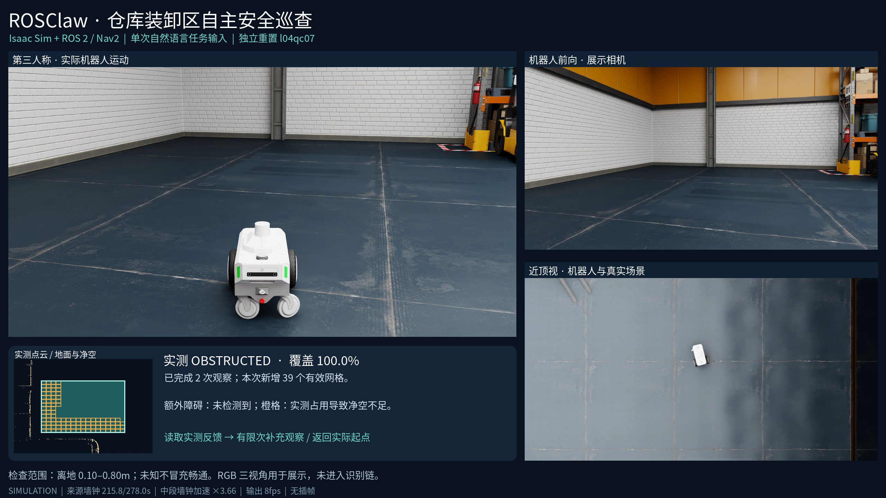
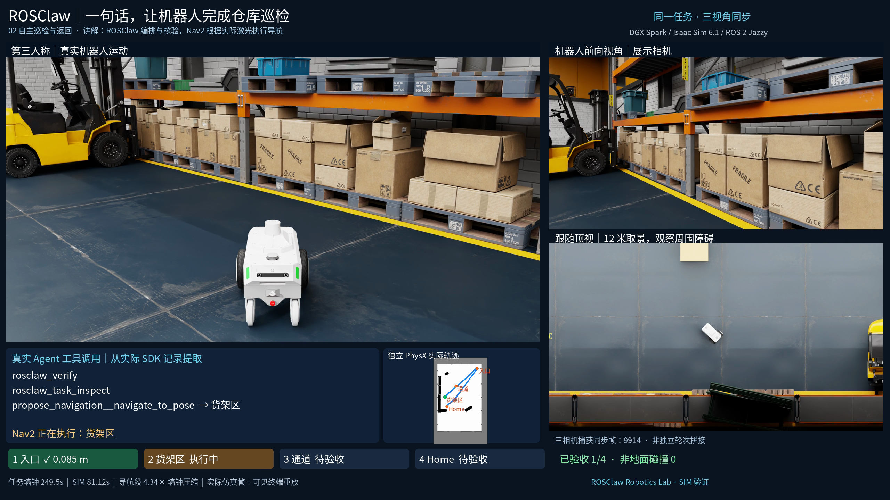

# ROSClaw Robotics Lab

**One natural-language task → a physically verified warehouse patrol.**

A real ROSClaw Native Agent runs Nova Carter in NVIDIA's official Isaac Sim 6.1 warehouse through ROS 2 Jazzy/Nav2 on DGX Spark. **v0.2: 14/16 frozen-source attempts passed independent physical acceptance**; at least five independent Native trials per condition, with startup and provider failures retained. 56 visits in accepted complete missions; maximum actual position error 0.151827 m. These are local SIM engineering results; production reliability and hardware execution are not established.

**Challenge 02 is now Warehouse Loading-Area Inspection:** identify the forklift near shelves from facility geometry, generate Nav2-verified viewpoints, inspect actual raw point clouds, take bounded additional views, then return and save verified Memory. All 12 independent resets passed (A 3/3 · B 3/3 · C 3/3 · D 3/3); 27 verified visits, maximum position error 0.172721 m, zero non-floor contacts. Across all loading attempts on this same final lab source, including calibration/interrupted batches and excluding legacy compatibility, outcomes remain 20 PASS / 1 FAIL; the final protocol result does not erase those failures. Earlier same-source initial-turn task failure remains in the complete ledger; unrestricted-start reliability is not claimed. [Task, four challenge conditions and video](challenges/02-semantic-inspection/README.md).

## Scenario challenges

| Challenge | User task and capability | Acceptance and status | Watch |
|---|---|---|---|
| [01 · Warehouse patrol](challenges/01-isaac-warehouse-patrol/README.md) | One prompt selects four sites; reordered and unmapped-box variants | v0.2: 14/16 complete physical acceptances; arrival/dwell, LiDAR, contacts and final Memory/TaskKernel | [180s promo](https://github.com/ros-claw/rosclaw-robotics-lab/releases/download/warehouse-patrol-v0.2.0/rosclaw-warehouse-promo-180s.mp4) · [510s tutorial](https://github.com/ros-claw/rosclaw-robotics-lab/releases/download/warehouse-patrol-v0.2.0/rosclaw-warehouse-tutorial-510s.mp4) |
| [02 · Loading-area inspection](challenges/02-semantic-inspection/README.md) | Near-shelf relation, generated viewpoints, measured clearance, second-view gains and UNKNOWN refusal | A 3/3 · B 3/3 · C 3/3 · D 3/3; earlier failures separate; actual post-merge source and Native build; engineering evidence only | [90s three views + actual LiDAR](https://github.com/ros-claw/rosclaw-robotics-lab/releases/download/loading-area-inspection-v0.4.0/loading-area-inspection-90s.mp4) |
| [Historical 02 · v0.3 shelf observation](challenges/02-semantic-inspection/README.md) | Generate observation poses from USD-known shelves and return to measured initial pose | Development/integration: 5 attempts, 1 FAIL and 4 complete PASS (3 with region LiDAR); recording failure retained; different source revisions, not a reliability batch | [90s synchronized views](https://github.com/ros-claw/rosclaw-robotics-lab/releases/download/semantic-observation-v0.3.0/rosclaw-semantic-promo-90s.mp4) |

Historical fifth-mission videos and the frozen v0.2 regression are separate evidence. Each challenge describes its task, tools, physical gates, failures and reproduction steps.


[](https://github.com/ros-claw/rosclaw-robotics-lab/releases/download/loading-area-inspection-v0.4.0/loading-area-inspection-90s.mp4)

[Final implementation report](FINAL_IMPLEMENTATION_REPORT.md) · [English tutorial](challenges/02-semantic-inspection/docs/LOADING_TUTORIAL.md) · [中文完整报告](deliverables/v04/IMPLEMENTATION_REPORT.zh.md) · [Audit and all attempts](deliverables/v04/README.zh.md)

RGB views are display-only; actual inspection uses PointCloud2. CLEAR/OBSTRUCTED/UNKNOWN are separate from task PASS. External reproduction and a fair Codex comparison remain NOT RUN. [Upstream PR #660](https://github.com/ros-claw/rosclaw/pull/660) is merged; the actual merge SHA was fetched, rebuilt and used in physical regressions.

[](https://github.com/ros-claw/rosclaw-robotics-lab/releases/download/warehouse-patrol-v0.2.0/rosclaw-warehouse-promo-180s.mp4)

[60s](https://github.com/ros-claw/rosclaw-robotics-lab/releases/download/warehouse-patrol-v0.2.0/rosclaw-warehouse-short-60s.mp4) · [180s](https://github.com/ros-claw/rosclaw-robotics-lab/releases/download/warehouse-patrol-v0.2.0/rosclaw-warehouse-promo-180s.mp4) · [510s](https://github.com/ros-claw/rosclaw-robotics-lab/releases/download/warehouse-patrol-v0.2.0/rosclaw-warehouse-tutorial-510s.mp4) · [Release](https://github.com/ros-claw/rosclaw-robotics-lab/releases/tag/warehouse-patrol-v0.2.0)

[中文](README.zh.md) · [English tutorial](challenges/01-isaac-warehouse-patrol/docs/tutorial_en.md) · [Evidence and status](deliverables/v02/STATUS.md)

| Frozen-source condition | All attempts | Native started | PASS |
|---|---:|---:|---:|
| standard | 6 | 5 | 5 |
| reordered | 5 | 5 | 5 |
| unmapped-box | 5 | 5 | 4 |

The Agent observes ROS and proposes one registered site at a time. Agentd/Operator/rosclawd owns the Body-bound SIM execution; Nav2 plans and controls motion. Each visit requires Nav2 success, ≤0.4 m independent physical error, ≥2 simulated seconds stable dwell, fresh LiDAR and complete zero non-floor contact evidence. Final ordered receipts and verified Practice/Memory must precede TaskKernel closure. There is no Agent-side Runtime, raw wheel tool or one-shot patrol executor.

The unmapped-box condition additionally checks original static-map free cells, actual LiDAR hits, local master-costmap occupancy and conservative footprint clearance. Separate actual SIM negative tests cover timeout, disconnect, paused physics with post-resume stop verification, and real Navigator ABORT while a real FollowPath controller remains active. Failed attempts remain in the [fault index](deliverables/v02/FAULT_TESTS.md).

Runtime source: `09739cb34c8a1d37ad95cfa4f146ad1e47798ec3`; upstream runtime: `21838614bb14c39599b8acef731b2b64dad3b92a`. Later documentation/test commits and newly merged upstream Harness PRs are recorded separately. File hashes bind the release to the physically tested runtime. See [full metrics](deliverables/v02/regression-metrics.json), [performance method](deliverables/v02/PERFORMANCE_PROTOCOL.md), [Harness audit](deliverables/v02/HARNESS_AUDIT.md), and [implementation report](deliverables/v02/IMPLEMENTATION_REPORT.zh.md).

Known limitations: [Isaac startup timeout](deliverables/v02/STARTUP_FAILURE.md) and [provider stall/aborted request](deliverables/v02/PROVIDER_FAILURE.md). The extra target of five accepted missions per condition is reported separately and is not forced by retries.

The five historical October 8 successes used different integration revisions. The three videos all depict the same historical fifth mission with synchronized robot-forward, third-person and close-top cameras; they are not recordings of the new sixteen-attempt batch. The 60-second edit marks jumps; source time/speed labels remain. Output FPS and repeated real frames are not camera acquisition FPS. [Historical v0.1](https://github.com/ros-claw/rosclaw-robotics-lab/releases/tag/warehouse-patrol-v0.1.0) and [pre-freeze failures](deliverables/v02/preliminary) remain separate.

```bash
cd challenges/01-isaac-warehouse-patrol
./scripts/setup.sh
python3 scripts/lab.py doctor
python3 scripts/lab.py start headless patrol
# Start observers and submit one Native task as described in the tutorial.
python3 scripts/lab.py stop
```

The unified entry also provides `task`, `results` and fifteen-reset `regression SHORT_DIRECTORY`. Startup sends no goals. Use official online assets and accept NVIDIA's license yourself. The public Docker base manifest is pinned; apt resolution may vary, so record the actual local image ID and packages. No NVIDIA installer/USD/cache, authentication, operator keys, private model home or full video is committed to Git.

[Independent reproduction handoff](deliverables/v02/reproduction/README.md): **external execution NOT RUN**, no engineer/second machine assigned. Offline archive replay is evidence consistency, not a new simulator run. The historical Challenge 02 v0.3 prototype generates observation poses from actual USD/map/pose/Body inputs and passed development-set navigation plus known-region LiDAR observation; held-out and fair-comparison evaluation remain pending. Fair runtime and development-efficiency studies are designed separately; no superiority over Codex is claimed. This SIM uses SQLite Memory and disables optional firewall integration; it does not validate all security modules or seekdb performance.

Sources: [ROSClaw](https://github.com/ros-claw/rosclaw), [NVIDIA workspace](https://github.com/isaac-sim/IsaacSim-ros_workspaces/tree/IsaacSim-6.1.0).
