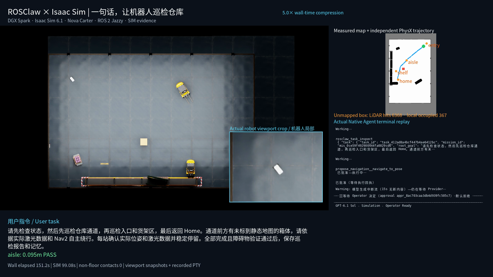

# ROSClaw Robotics Lab

**一句自然语言，让机器人完成有物理证据的仓库巡检。**

真实 ROSClaw Native Agent 已在 DGX Spark 上，通过 ROS 2 Jazzy/Nav2 控制
Isaac Sim 6.1 官方仓库中的 Nova Carter。**四次完整重置任务通过独立验收**，
包含改变自然语言顺序和未映射静态障碍物。证据来自仿真，未验证真实硬件执行。

[](https://github.com/ros-claw/rosclaw-robotics-lab/releases/download/warehouse-patrol-v0.1.0/rosclaw-warehouse-promo.mp4)

[80 秒宣传片](https://github.com/ros-claw/rosclaw-robotics-lab/releases/download/warehouse-patrol-v0.1.0/rosclaw-warehouse-promo.mp4)
· [完整 Native 任务视频](https://github.com/ros-claw/rosclaw-robotics-lab/releases/download/warehouse-patrol-v0.1.0/rosclaw-warehouse-workflow.mp4)
· [公开证据包](https://github.com/ros-claw/rosclaw-robotics-lab/releases/tag/warehouse-patrol-v0.1.0)

新增 [1080p 三视角预览](https://github.com/ros-claw/rosclaw-robotics-lab/releases/download/warehouse-cameras-v0.1.1/warehouse-camera-views.mp4)：
机器人前向、第三人称跟随和近距离顶视。它来自单点 Nav2 相机测试，
独立于上述 Native 巡检视频；设置方法见 [相机指南](challenges/01-isaac-warehouse-patrol/docs/camera-views.md)。

Agent 发现 ROS 能力，逐站提出导航，监控结果、返回 Home，最后写入现有
Practice/Memory。物理执行权只在 rosclawd，不使用假模型、Agent 内部 Runtime
或一键整圈巡检工具。每站要求 Nav2 成功、实际误差 ≤0.4 米、稳定停留 ≥2 仿真秒、
新鲜 LiDAR 和零非地面接触。TaskKernel 在最终记忆收据完成之后关闭。

前三次分别完成标准巡检两次、改序巡检一次。第四次使用公开 Docker 构建和未映射
箱体，完成“通道→入口→货架→Home”，实际误差为 **0.095 / 0.094 / 0.132 / 0.090 米**。
四轮 16 个到点的最大误差小于 0.151 米。箱体实验记录了 6,368 个真实点云命中、
367 个局部主代价地图占据单元、超过 0.35 米的保守足迹净距，以及零非地面接触。
真实运动后的超时取消和断连 DDS 取消也分别通过故障测试。

```bash
cd challenges/01-isaac-warehouse-patrol
./scripts/setup.sh
./scripts/doctor.sh
ROSCLAW_CAMERA_VIEW=top ROSCLAW_CAPTURE_SECONDS=1400 ./scripts/demo.sh streaming patrol
# 另一终端持续运行：
./scripts/start-agent-observers.sh
# 按教程向真实 Native Agent 发送一句任务。
```

见 [中文复现教程](challenges/01-isaac-warehouse-patrol/docs/tutorial_zh.md)、
[执行架构](challenges/01-isaac-warehouse-patrol/docs/architecture.md)、
[失败记录](challenges/01-isaac-warehouse-patrol/docs/failures.md)、
[验收汇总](challenges/01-isaac-warehouse-patrol/reports/acceptance-summary.json) 和
[实施报告](FINAL_IMPLEMENTATION_REPORT.md)。

启动脚本不发目标，官方基线与 Agent 验收分开。视频组合真实带时间戳的仿真帧、
可见终端记录及 PhysX，宣传片明确标注时间压缩，完整任务以 2 fps 保留全部墙钟时间。
这是逐帧重建，不是连续屏幕录像。私有思考、模型认证和操作员密钥不会公开。

成功轮次对应集成过程中的不同源码快照和 Body 哈希；失败轮次也保留，不能据此
宣称统计成功率。公开 ARM64 Dockerfile 及其运行已在本机验证，独立工程师在干净
机器上的复现仍待安排。外部 WebRTC 客户端、中国资产区域和动态行人尚未验证。
仓库不分发 NVIDIA USD、安装包、大型缓存、私有模型目录或完整视频。
