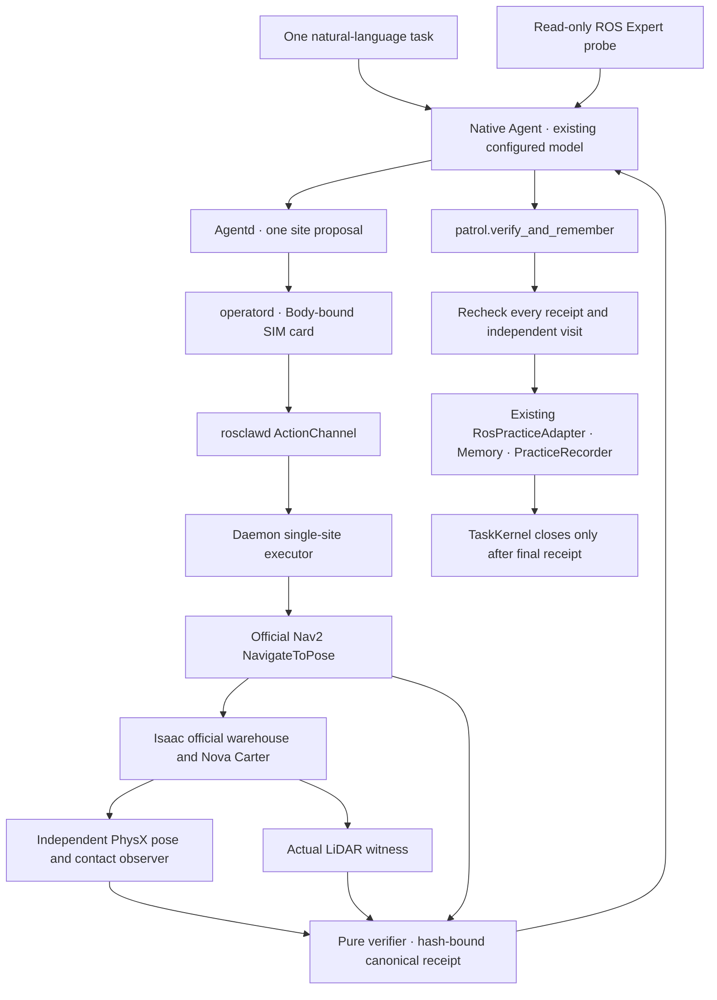

# Execution and evidence ownership

The Agent cannot execute motion through its MCP process. Its action declarations
are materialized as guarded proposals. Only the daemon registers the Nav2 executor.
That executor resolves one measured site ID and never knows or executes a patrol
sequence. Expected order is held for final acceptance, not sent as a navigation
program. SIM receipts explicitly remain unusable as real-hardware verification.

Per-run source manifests bind the public source snapshots, configuration, compiled
Body, pinned upstream commit and Docker image ID. Successful navigation receipts
bind the raw trajectory artifact SHA-256. Independent evaluation repeats the
arrival/contact/LiDAR calculations and rejects early TaskKernel closure. Public
summaries expose tool calls and final answers, never raw private model reasoning.
