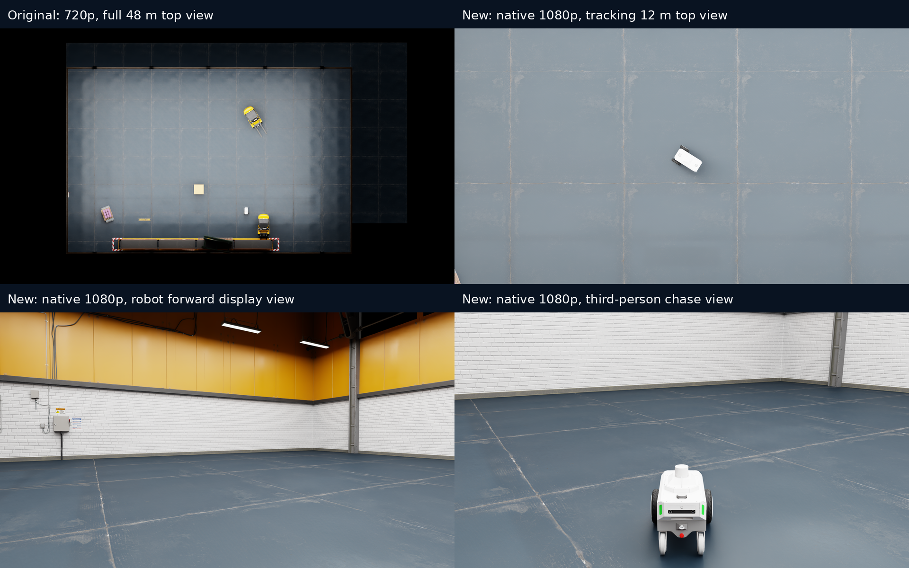

# 相机取景 / Camera views

显示相机写入 USD session layer，通过独立 PhysX chassis 状态跟随机器人。
它们没有碰撞体，不向 Nav2 发目标，不替换 LiDAR，也不会启用工厂 Hawk ROS
相机链路。`robot` 是机器人前向的展示画面，不能当作已验证的 ROS 图像话题。

| `ROSCLAW_CAMERA_VIEW` | 取景 / Framing |
| --- | --- |
| `top` | 固定全仓库顶视，默认横向 48 m / fixed warehouse overview |
| `top-close` | 跟随机器人顶视，默认横向 12 m，朝向保持固定 / tracking close top view |
| `follow` | 后方 3 m、高度 1.4 m 的第三人称跟随 / third-person chase camera |
| `robot` | chassis 前方 0.65 m、上方 1.0 m，随真实姿态前向观察 / forward onboard display |
| `overview` | 固定斜俯视 / fixed oblique overview |
| `official` | 保留官方相机 / original stage camera |

原验收视频的仓库原始画面为 1280×720；视频成片虽然为 1920×1080，仓库部分
仍为 1280×720，全仓库镜头中的机器人只占几十个像素。裁剪放大不会增加细节。
新版默认设置底层 viewport 为原生 1920×1080。近顶视把覆盖宽度从 48 m 缩到
12 m，使机器人横向像素数增加约四倍；1080p 对比 720p 又增加约 1.5 倍。
两者合计约六倍是相同朝向下的几何估算，不是图像质量测试分数。

The original acceptance footage used native 1280×720 warehouse captures. Encoding
a larger composite or enlarging a crop cannot recover missing detail. The default
viewport now renders at native 1920×1080. A 12 m close top view gives about four
times the robot's horizontal pixels compared with the 48 m overview at the same
resolution. Orthographic zoom is controlled by aperture, so lowering the camera
alone would not enlarge the robot in this top view.

选择一个固定视角启动；修改视角前先停止当前项目，再重新启动。此前运行中切换
投影曾导致渲染停滞，所以本次继续使用每轮固定投影。移动镜头仅更新相机位姿。
相机渲染会增加 GPU 负载；这些配置不代表仿真与墙钟时间相等。

```bash
cd challenges/01-isaac-warehouse-patrol
./scripts/stop.sh
ROSCLAW_CAMERA_VIEW=follow ROSCLAW_CAMERA_RESOLUTION=1920x1080 \
  ROSCLAW_CAPTURE_SECONDS=1400 ./scripts/demo.sh streaming patrol
```

把 `follow` 改为 `robot` 或 `top-close` 即可；近顶视可额外设置
`ROSCLAW_TOP_WIDTH_M=8`，进一步拉近，但会减少周边可见范围。设置同样适用于
`start-sim.sh`。1920×1080 是推荐起点，`3840x2160` 可用于高质量截图，但
在本次验证中不声明已测试 4K。PNG 帧与实际分辨率记录在输出目录的
`baseline-frames/` 和 `timestamps.jsonl` 中。

Use one view per simulator run; stop the project before changing projection.
`ROSCLAW_CAMERA_RESOLUTION` controls the underlying rendered viewport, not the
encoded video size. This follows the NVIDIA [Viewport API](https://docs.omniverse.nvidia.com/kit/docs/omni.kit.viewport.docs/109.0.0/viewport_api.html)
(`fill_frame=False`, explicit `resolution`). It is applied once before captures;
the capture waits for rendered frames before writing the first PNG.

新增视角的单点 Nav2 测试只验证相机、真实运动和渲染稳定性，不计入之前的四轮
Native Agent 验收，不会将新的测试画面拼接成同一轮旧验收任务。

三种最终镜头已分别在独立重置后的 Home→Aisle 单点测试中通过：实际运动约
9.96–9.98 m，Nav2 status 4 / error 0，结束时 PhysX 观测新鲜、零非地面碰撞。
第三人称的较高初版也通过测试，但最终采用较低镜头，让前方环境更容易看清。
原始测试记录见 [相机验证](../reports/camera-close-validation/validation.json)。



[45 秒真实三视角预览](https://github.com/ros-claw/rosclaw-robotics-lab/releases/download/warehouse-cameras-v0.1.1/warehouse-camera-views.mp4)
采用三轮单点测试的真实 PNG，分别压缩墙钟时间；每段标明实际倍速。原始截图：
[机器人前向](../reports/camera-close-validation/robot.png)、
[第三人称](../reports/camera-close-validation/follow.png)、
[近顶视](../reports/camera-close-validation/top-close.png)。
