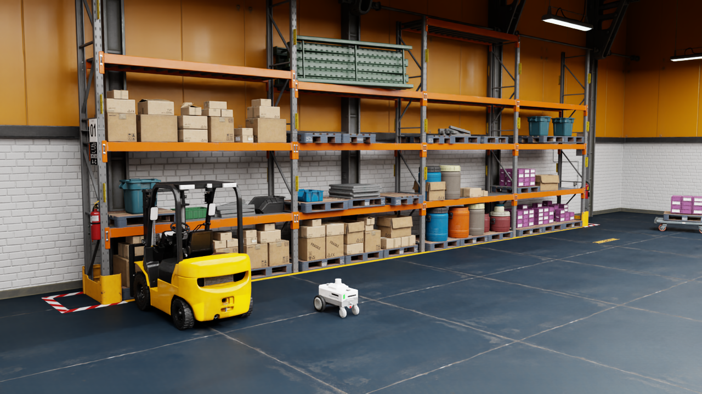

# DGX Spark 本机仿真操作

本教程覆盖已实测的环境基线。ROSClaw 自主巡检与干净机器安装教程仍待完成。

## 已固定的环境

Ubuntu 24.04.4 aarch64、GB10、驱动 580.159.03、Isaac Sim 6.1.0（发布 ZIP 内部 VERSION 为 6.1.0-rc.26）、ROS 2 Jazzy。Isaac 安装在 `~/isaacsim`，官方工作空间在 `~/IsaacSim-ros_workspaces/jazzy_ws`，固定 IsaacSim-6.1.0 tag。ROSClaw 上游源码在 `~/sim/rosclaw-upstream`，现有实验 runtime 未替换。

安装包 MD5 已校验，EULA 已确认，post_install、兼容性检查和预热均通过。本机 Jazzy 已安装，但宿主机缺 Nav2、sudo 非交互不可用，所以导航依赖在 ARM64 Docker 中运行；没有修改驱动或宿主机 ROS。

## 检查与启动

```bash
cd ~/sim/rosclaw-robotics-lab/challenges/01-isaac-warehouse-patrol
./scripts/doctor.sh
./scripts/demo.sh streaming
```

已有本项目会话时，先运行 `./scripts/stop.sh`。冷启动曾需要约 9.5 分钟加载场景；热启动通常约一分钟达到独立物理采样。demo 会等待新鲜的 PhysX 状态、Nav2 生命周期 active 和 NavigateToPose 服务就绪，最长等待场景 20 分钟。日志在 `reports/runs/<UTC 时间>/`。

Streaming 服务在本机启动，局域网地址为 `192.168.43.130`。可使用 [NVIDIA WebRTC Client](https://docs.isaacsim.omniverse.nvidia.com/6.1.0/installation/manual_livestream_clients.html) 连接。外部客户端画面尚未实际验收；仓库视口 PNG 已直接从 Isaac 渲染器采集。



独立运行步骤：终端 A 执行 `./scripts/start-sim.sh streaming`，等待 reports/physics-latest.json 更新；终端 B 执行 `./scripts/start-nav2.sh calibration`。`official` 模式使用 NVIDIA 原始参数，`calibration` 模式使用单独保存的候选低噪声 AMCL 与 0.10 m Nav2 容差配置。

## 官方三目标基线

```bash
./scripts/smoke-official.sh > reports/manual-three-goals.log 2>&1
```

这个脚本会先向 AMCL 发布官方初始姿态，因此只能在场景刚重置、机器人位于 Home 时运行。不得在机器人已经移动后反复调用并重置定位。正式 Agent 演示不能启动它。

默认参数实测物理误差 0.107 / 0.297 / 0.543 m，第三点超过 0.4 m；独立重置后的校准测试为 0.146 / 0.174 / 0.079 m。详见 `reports/calibrated-baseline-summary.json`。评分器同时核验 Nav2 的 Goal succeeded 日志和新鲜的物理位置；仅有 error_code=0 不足以证明成功。碰撞分类尚未验收，保持 UNKNOWN。

`reports/official-baseline.mp4` 是真实视口帧按墙钟时间戳编码的录像，属于离散帧序列，不是连续客户端屏幕录制，也不是 ROSClaw 宣传片。视口采集默认运行 180 秒，可通过 `ROSCLAW_CAPTURE_SECONDS` 调整。

## 接口与隔离

本项目 ROS_DOMAIN_ID=61，Fast DDS，Docker 使用 host network / host IPC，并以当前 UID 运行。已实际收到 clock、chassis odom、scan、点云和地图；map→odom→base_link 可查询。摄像机渲染产品在 session layer 关闭，LiDAR 保留。NVIDIA 原始 USD 不修改。四个非必要 Hawk 摄像头的 ROS variant 在 session layer 设为 Disabled，已复测消除官方资产循环 Payload 引用。

运行时证据包括 reports/native-probe.json、ros-graph.json、system-model.json、runtime-audit.json。快照是当时状态，不能用于后续实时授权；较旧快照的 Harness diagnose 会明确报告 STALE/BLOCKED，正式接入必须刷新。

资产根目录由安装包的官方 US/China profile 解析，`ISAACSIM_ASSET_REGION_PROFILE=china` 可切换区域，或显式设置 `ISAACSIM_ASSET_ROOT`；根路径必须以 `/Assets/Isaac/6.1` 结束。China 实际网络加载尚未验证。

## 停止与下一阶段

```bash
./scripts/stop.sh
```

脚本只处理带本项目 label 的容器及 PID/birth_ticks 匹配的 Isaac 进程，不停止其他 Gazebo 实验。未完成部分包括语义巡检点、SIMULATION 专用 rosclawd 适配器、真实 Native Agent 会话、到点稳定性与零有效碰撞验证、三次重置任务、双语完整教程、视频和 GitHub 发布。不得把这套环境基线宣传为这些功能已经完成。
