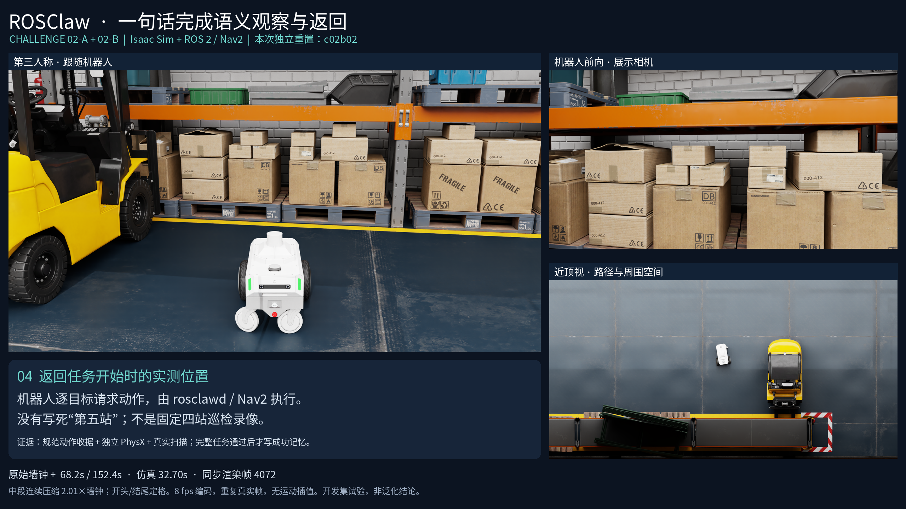

# Challenge 02 — USD-known semantic inspection

目标：让 Agent 从一句区域描述选择 USD 语义目标，生成并验证新观察位置，复用现有 rosclawd/Nav2 受控导航。禁止增加一个写死的第五站并称作空间理解。

**开发集端到端验收已通过。** 2026-10-09 共保留 4 次独立重置尝试：首轮 FAIL，随后 02-A 导航任务一次 PASS、02-B 区域 LiDAR 任务两次 PASS；这不是同一冻结版本的可靠性统计。最新一轮同步三视角完整覆盖 Native 执行，已制作本 Challenge 自己的展示视频。

v0.2 的只读生成原型保持 `authorization=false`、`execution_allowed=false`。v0.3 通过现有 rosclawd 的新 SIM Body 契约执行候选；运行时从真实仓库 USD 清单、官方地图、当前 PhysX 位姿与已编译 Body 生成目标，没有向原四站配置增加一个固定站点。

`propose_observation.py` 不读取 `inspection_sites.yaml`。它使用真实货架 prim 包围盒，在边界外生成面向目标的候选；按机器人足迹外接圆、Nav2 padding、额外余量、占据/未知单元、地图边界、当前位姿的可达连通域及静态视线筛选。物理状态须新鲜、时间线播放中、接触观察完整且无碰撞。坐标、地图/配置/Body/观察者来源及 proposal hash 一起输出。

保守静态地图分析不能证明实时安全路径。执行前必须在现有 daemon 内重新验证最新地图/Costmap、TF/时钟、机器人位姿、Body intent 和 Nav2 ComputePathToPose 的扫掠足迹，再通过现有 `request_action` 派发。本阶段另验实际扫描端点落入已知货架区域；未知空间、动态障碍、视觉目标识别和缺陷检测仍需另做实验。

```bash
# 使用已安装 ROSClaw 环境（numpy/Pillow/scipy/PyYAML）；不连接运动接口
python propose_observation.py \
  --inventory ACTUAL_PHYSICS_RUN/stage-inventory.json \
  --map-yaml /path/to/carter_warehouse_navigation.yaml \
  --physics ACTUAL_PHYSICS_RUN/physics-latest.json \
  --body ACTUAL_NATIVE_RUN/body.json \
  --nav-params ../01-isaac-warehouse-patrol/config/patrol_navigation_params.yaml \
  --target '/World/.../SM_RackShelf_...' --output proposal.json
python -m unittest discover -s tests
```

语义来源是 USD 已提供的 prim 名称和几何包围盒，属于场景先验；没有声称相机发现目标。展示相机不成为 Agent 的视觉传感器。

按实际物理货架实体分组：同一货架的父/子 prim 合并到最外层 RackShelf Xform，再按实体路径 SHA256 前 8 位模 4 等于 0 固定 holdout。实际清单得到 **8 个开发实体、5 个 holdout 实体**。v0.2 只对一个开发实体生成候选；本阶段目录覆盖全部 8 个开发实体，其中 4 个通过静态候选筛选，实际任务选择其中一个实体。holdout 未运行。分组规则及目标 manifest 必须在正式实验前冻结，并向参试 Agent 隐藏 holdout 清单。当前没有泛化实验结论。完整原始 USD 清单进入公开审计证据，因此后续严格未知场景对照须使用新布局/新目标并在测试前冻结，不能把已公开的几何信息称作未知场景。早期 prim 级划分已弃用，避免同一货架父/子 prim 跨组泄漏。

完整执行设计见 [DESIGN.md](DESIGN.md)，公平对照的配对、消融、分母和开发计时方案见 [FAIR_COMPARISON.zh.md](FAIR_COMPARISON.zh.md)。实际对照尚未运行。

## 场景任务与阶段

| 阶段 | 用户指令与输入 | 验收门槛 | 状态 |
|---|---|---|---|
| 02-A 语义观察点导航 | “去本次起点西侧最近的一组开发集货架，面向货架观察，再返回实际起点。”；USD 已知货架、地图、实际位姿 | 目标语义正确；动态坐标不来自四站配置；Body/候选 ID 绑定；最新 Nav2 路径及扫掠足迹；真实到达/朝向/停留/接触；最终 Memory/TaskKernel | 开发试跑 PASS（c02a02） |
| 02-B 已知区域 LiDAR 观测 | 同一任务，增加实际扫描端点落入目标区域的验证 | 02-A 全部门槛，加上已知时间和 map→LiDAR 变换、至少 3 个实际目标区域回波 | 两次开发试跑 PASS（c02b01/b02）；不代表视觉识别或缺陷检测 |
| 02-C 留出目标与公平对照 | 冻结后揭示目标，同模型/工具/预算的配对任务 | 所有失败、拒绝和人工介入留存，分开报告运行与开发效率 | 尚未执行 |

**挑战在哪里：** 02-A 要从对象几何生成新观察位置，验证实时可达路径与整个机器人足迹，并返回实测起点；02-B 进一步区分“机器人到达”与“传感器完成观测”，将真实扫描、TF 和同时刻停止/朝向状态绑定。02-C 则要求避免开发目标泄漏，并在同模型、工具、预算下公平比较。

新增 SIM Body 在用户输入前冻结开发目标集合、源文件哈希、实测起点和校验规则。Native 只读 daemon 生成的目录，通过 `proposal_id` 请求单次动作；不能提交任意 x/y 或改写四站权限。候选会过期，执行前重新读取 TF/时钟/Costmap，并对 Nav2 规划的完整路径按半地图单元平移和 0.05 rad 旋转间隔检查足迹。

## 执行与留存

在已配置且没有其他本项目仿真会话的环境中：

```bash
# ROSCLAW_SOURCE 必须是本次冻结并编译的 checkout；固定 Python 必须导入该 checkout。
export ROSCLAW_SOURCE=/path/to/pinned/rosclaw
export PYTHONPATH="$ROSCLAW_SOURCE/src${PYTHONPATH:+:$PYTHONPATH}"
export ISAAC_ROS_WS="$HOME/IsaacSim-ros_workspaces/jazzy_ws"
"$ROSCLAW_SOURCE/.venv/bin/python" run.py --output "$HOME/sim/c02a01" --isolated-simulation
# 独立重置另一个输出目录，增加真实区域 LiDAR 观测和三视角录制：
"$ROSCLAW_SOURCE/.venv/bin/python" run.py --output "$HOME/sim/c02b01" --isolated-simulation \
  --require-target-lidar --record-multiview
```

`run.py` 只做测试编排；任务由真实 Native Agent 接收一次输入，通过原有 Agentd/Operator/rosclawd 执行。每次创建独立重置，拒绝覆盖输出，保留失败并清理本项目资源。`evaluate.py` 重放规范收据、独立 PhysX 轨迹、路径足迹、语义任务和 Memory/TaskKernel。开发试跑不等于留出集或公平比较。

## 视频展示

[](https://github.com/ros-claw/rosclaw-robotics-lab/releases/download/semantic-observation-v0.3.0/rosclaw-semantic-promo-90s.mp4)

[90 秒展示片](https://github.com/ros-claw/rosclaw-robotics-lab/releases/download/semantic-observation-v0.3.0/rosclaw-semantic-promo-90s.mp4) · [证据与下载](https://github.com/ros-claw/rosclaw-robotics-lab/releases/tag/semantic-observation-v0.3.0)

对应 **c02b02** 同一次独立重置：左侧第三人称、右上机器人前向、右下近顶视。三路来自同一实际渲染帧，190 组画面覆盖完整 Native 执行，最大采集间隔 1.046 秒；视频中段连续压缩墙钟时间，开头/结尾定格，8 fps 编码并重复最近真实帧，没有运动插值。展示相机不作为 Agent 视觉输入。字幕是据实编写的说明，不冒充 Agent 原话。

## 完整开发尝试记录

| 尝试 | 验收 | 货架 / 返回位置误差 | 区域回波 | 录像 | 说明 |
|---|---|---|---:|---|---|
| c02a01 | FAIL | 首个目标 0.100749 m / 未完成返回 | 未要求 | 未要求 | 目录 JSON 被 8000 字符截断；动作会话过期后复用导致拒绝；保留全部失败，无人工重发 |
| c02a02 | PASS | 0.096726 / 0.050037 m | 未要求 | 未要求 | 两目标、Memory、TaskKernel 完整通过 |
| c02b01 | PASS | 0.099695 / 0.041542 m | 132 | INCOMPLETE | 实际观测通过；录制参数误设 1 秒，不能用于完整任务宣传 |
| c02b02 | PASS | 0.100768 / 0.053119 m | 132 | PASS | 修正录制后独立重置；对应本页视频 |

成功整项任务共 6 次到点，均满足位置误差 ≤0.4 m、朝向误差 ≤0.35 rad、稳定停留 ≥2 仿真秒、完整接触观察和零非地面碰撞。首轮单点成功不计作完整任务成功。所有尝试都保留，均无人工重发。

运行 lab SHA 依次为 `dc75225`、`e727e939`、`3562bd6`、`5eafb708`。后三次使用上游候选构建 `8340a693801f28c2c0703a049e6306e5bd82b147`，包含两个新修复；不是已合并上游 main 的验收。每轮完整源码与 Native 编译哈希见证据包 `source-freeze.json`。

## 发现的问题与复现

- 上游 [#657](https://github.com/ros-claw/rosclaw/pull/657)：超预算观察结果不再截成非法 JSON，而以 `CAPABILITY_OUTPUT_TOO_LARGE` 明确失败，提示缩小查询；实验接口同时提供有界目录。
- 上游 [#659](https://github.com/ros-claw/rosclaw/pull/659)：每个分别批准的非 REAL 动作创建独立有界会话，结束后关闭；不复用 LOST 会话，也不重放旧动作。
- 本实验失败验收器处理空收据，录制检查与任务物理验收分别报告。旧失败原件保留，不用新版结果覆盖。

证据导出使用 `collect_evidence.py` 明确白名单，不导出认证、操作员密钥、私有 Agent home、完整思考或私有账本。解压后可使用该次冻结的 `evaluate.py` 离线复核成功任务，见 [交付与复现](../../deliverables/v03/README.zh.md)。离线重放验证证据自洽，独立工程师和第二台机器实测仍为 **NOT RUN**。
