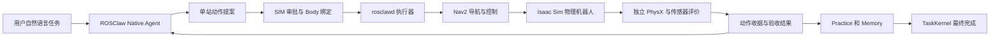

> 历史归档：以下为截至 2026-10-08T23:28Z 的五轮集成报告，不代表 v0.2 冻结源码、新回归或新上游 PR 的验收。当前结果见 IMPLEMENTATION_REPORT.zh.md。保留原叙述以审查当时证据与失败。

# ROSClaw 仓库巡检实施与能力评估报告

初版日期：2026 年 10 月 8 日。更新日期：2026 年 10 月 9 日。实验与交付证据截至 10 月 8 日 23:28 UTC，本次更新核对本地验收报告、视频元数据、故障记录和源码状态，未新增机器人实验。文件名保留原始日期。

对象：DGX Spark 上 Isaac Sim 6.1、Nova Carter、ROS 2 Jazzy 和 Nav2 的仓库自主巡检。报告供项目负责人评估当前能力、演示可信度、后续投入与 ROSClaw 和 Codex 的分工。

**结论：ROSClaw 已经能胜任本次经过配置和约束的仿真巡检任务，适合继续作为机器人任务运行入口。当前证据支持可运行的工程演示，尚不足以支持生产级可靠性或优于 Codex 的性能结论。** 累计五轮独立重置的完整 Native Agent 任务通过物理验收，包括自然语言改变巡检顺序、未映射静态箱体避障，以及同步三视角负载下的一句话任务。20 次到点最大位置误差为 0.15019 米，五轮均为零有效非地面碰撞。第五轮已制作 3 分钟宣传片和 8 分 30 秒完整教程，均为 1440p、中文合成旁白和字幕。失败的完整任务、启动尝试与故障测试均另行保留，五轮成功不构成统计成功率。

我建议继续使用 **Codex 搭建、调试和维护系统，ROSClaw 编排和运行受约束的机器人任务，Nav2 执行导航，独立评价器判定物理结果**。本次 ROSClaw 使用的模型就是 `openai-codex/gpt-6.1-sol`；ROSClaw 的作用主要体现在机器人接口、执行约束、任务状态和证据管理，不能把结果解读为另一种模型比 Codex 模型更聪明。

## 一 实施目标与完成范围

原始任务书：[rosclaw_sim_lab初步实施建议1008.md](/home/nvidia/sim/rosclaw_sim_lab初步实施建议1008.md)。目标是在官方在线仓库 USD 中，让用户通过真实自然语言会话驱动 Nova Carter 检查入口、货架和通道，返回 Home，并提供独立物理证据、教程、视频和开源工程。

| 项目 | 当前状态 | 验收范围 |
| --- | --- | --- |
| Isaac Sim ARM64 安装与启动 | 已完成 | 安装包校验、EULA 接受、安装后处理、兼容性检查、实际运行 |
| 官方在线仓库与机器人加载 | 已完成 | Isaac 6.1 官方资产、场景引用检查、真实 PhysX 与 LiDAR |
| ROS 2 Jazzy 和 Nav2 | 已完成 | ARM64 Docker、固定 NVIDIA 工作空间、构建与 Action 就绪 |
| 官方导航基线 | 已完成校准与诊断 | 与 Native 巡检验收分别记录 |
| ROSClaw Native 巡检 | 已完成五轮成功验收 | 标准顺序、改序、未映射静态箱体、同步三视角 |
| 独立物理评价 | 已完成 | 位姿、停留、碰撞、传感器新鲜度和任务持久化 |
| 超时和连接中断测试 | 已完成原测试与双服务器取消回归 | 单目标真实适配器故障测试；精确 Navigator-ABORT 孤立控制器场景仍待注入 |
| 中英文教程与开源 | 已发布 | 源码、配置、启动脚本、复现说明、失败记录 |
| 视频与相机增强 | 旧版已发布，新增同步视频已本地交付 | 新版 180 秒宣传片、510 秒教程、585 组三相机同步捕获 |
| 独立工程师干净环境复现 | 待安排 | 不能由本机测试、CI 或离线重放代替 |
| 仿真暂停恢复专项实测 | 未完成 | 单元测试的时钟拒绝行为不替代现场故障注入 |
| 动态行人和真实机器人 | 未验证 | 不纳入本次成功结论 |

本次同时包含工程开发和任务运行。场景集成、测量站点、Body 编译、Nav2 调参和相机调试由工程实施完成；ROSClaw 运行时收到一句任务，发现已提供的能力，逐站提出动作、检查结果并保存经验。不能把实施期间的全部开发工作归功于 ROSClaw 运行时自主完成。

## 二 实际环境与版本

| 组件 | 实际使用版本或位置 |
| --- | --- |
| 硬件 | NVIDIA DGX Spark，GB10，Linux aarch64 |
| 操作系统与驱动 | Ubuntu 24.04.4，NVIDIA 580.159.03 |
| Isaac Sim | `/home/nvidia/isaacsim`，6.1.0 ARM64 安装包；内部 VERSION 带 rc.26 标识 |
| 安装包 MD5 | `02824f6b3c20d941ab81bf33d027d40b`，实际校验通过 |
| NVIDIA ROS 工作空间 | IsaacSim-6.1.0，提交 `a9e8471ee901bc2332c1e4aca94ac580713ca3ab` |
| ROS 与导航 | Jazzy，Nav2；最终镜像内 nav2_bringup 1.3.13、rosbridge 2.7.1、pointcloud_to_laserscan 2.0.2 |
| ROSClaw 上游 | `/home/nvidia/sim/rosclaw-upstream`，提交 `21838614bb14c39599b8acef731b2b64dad3b92a`，未修改上游 checkout |
| 任务模型 | 已有配置 `openai-codex/gpt-6.1-sol`，没有另外部署本地大模型 |
| 最终 ROS 镜像 | `rosclaw/warehouse-jazzy:6.1.0-public`，ARM64 |
| 最终镜像 ID | `sha256:43cca6319ba787aed099db6cceb4ca22de4a24ab0d24b0f9a8b1ef14399ec232` |
| 最近已发布工程基线 | `351353690826760bb150aa30938dc957397faff4`，含单视角相机增强 |
| 新增本地工程状态 | 同步三相机、视频制作、通信等待、取消与就绪修复仍为未提交变更；本轮使用独立源码冻结，不宣称已包含在旧发行版中 |
| 完整巡检发行版 | `warehouse-patrol-v0.1.0`，提交 `e09d3cc56ae3917a1589c9c32ab7b2d97235899b` |
| 相机发行版 | `warehouse-cameras-v0.1.1` |

模型认证曾在录制期间失效：ROSClaw 保存的是过期的 access-only 登录，refresh 字段为空。准备脚本仅在配置账户与当前本地 Codex 账户一致、当前 access token 至少还有 30 分钟有效期时，更新隔离运行目录的凭据；不复制 refresh token、不改变全局凭据、不改变模型。错误尝试没有产生机器人运动，原始私有认证文件不进入报告或证据包。

ROS 工作空间的三个必要包已实际构建：`carter_navigation`、`isaacsim_bringup`、`isaac_ros_navigation_goal`。ROS 默认域为 61，使用 Fast DDS、本机范围通信；容器使用 host 网络和 IPC。工作空间挂载在 `/work`，与 symlink install 的构建路径一致。

宿主机没有可直接使用的非交互 sudo，本次使用 ROS Docker 实施，没有修改 NVIDIA 驱动、宿主机 ROS 或 Docker daemon 代理配置。镜像构建遇到 registry 连接问题后，使用项目专用、带现有代理的 BuildKit 构建器完成，构建器随后移除。Dockerfile 固定基础镜像 digest，但 apt 软件包仍可能随仓库更新；复现应参考每轮实际包版本和镜像记录。

## 三 仿真与导航集成

使用 NVIDIA 官方 Isaac 6.1 在线资产中的 `carter_warehouse_navigation.usd` 和 `Nova_Carter_ROS.usd`。原始资产未改写、未复制进 Git。显示标记、测试箱体和相机写入 USD session layer。

官方 Hawk ROS 相机变体在本次场景中引发循环 payload 问题，因此关闭其 ROS 变体，保留导航 LiDAR。仿真明确使用 PhysX，关闭 Newton 自动切换，并启用所需的运动 BVH 设置。独立物理观测直接读取真实 `chassis_link`，避免仅凭 ROS `/odom` 判断机器人是否运动。

官方默认导航曾出现约 0.543 米的目标误差，超过预先设定的 0.4 米容差。校准后的三个基线目标误差为 0.146、0.174、0.079 米。该基线报告的碰撞字段仍为 UNKNOWN，没有把它包装成完整巡检验收通过。详见 [校准基线](/home/nvidia/sim/rosclaw-robotics-lab/challenges/01-isaac-warehouse-patrol/reports/calibrated-baseline-summary.json)。

正式巡检使用单独的 Nav2 配置：调整 AMCL 更新、新鲜度与相关参数，使用实际发布的 chassis odometry，去掉未发布的二维扫描层，并根据真实 ROS Graph、TF、QoS 和生命周期状态做就绪检查。正式演示链路禁用官方自动目标节点，机器人任务由 ROSClaw 发起。

巡检位置来自实际地图和场景测量，当前支持四个注册站点：

| 站点 | 地图坐标 x 和 y，米 | 朝向，弧度 | 用途 |
| --- | --- | --- | --- |
| Entry | 7.5，16 | π/2 | 入口 |
| Shelf | −7，3 | π | 货架区 |
| Aisle | −2，8 | π/2 | 仓库通道 |
| Home | −6，−1 | π | 返回起点 |

这证明了已注册站点上的自然语言编排。尚未证明机器人能在陌生仓库中自行识别“入口”或“货架”、建图并生成这些站点。当前“巡检”是访问检查点、验证导航和传感器状态，未包含图像识别破损货物、读表或生成设备故障诊断。

## 四 ROSClaw 实际执行链路

正式测试启动真实 Native Agent、Agentd、TaskKernel、operatord 和 rosclawd，并通过真实模型会话执行。Agent 能读取状态与能力、调用 ROS 观测、提出单站导航、验证收据并请求保存巡检经验。没有提供一个预先编码好整圈路线的巡检工具，也没有用假模型替代 Agent。

执行关系如下：

本项目编译了基于实际机器人结构的 eURDF/Body 和能力绑定，执行器只接受注册站点，核验仿真域和 Body 哈希。机器人动作由 daemon 拥有；Agent 内部没有另起运动 Runtime，MCP 工具声明不能直接绕过 daemon 执行运动。

任务测试程序发送一次自然语言输入。期望站点顺序作为独立验收合同，执行器不会把整条路线作为脚本交给 Agent。标准任务访问 Entry→Shelf→Aisle→Home；改序任务要求 Aisle→Entry→Shelf→Home，Agent 实际按新顺序逐站提案。

测试 operator 自动批准符合约束的 SIM 动作卡，因此属于受控仿真中的自动执行。它保留了审批和绑定链路，不等于绕过审批；也不证明真实硬件环境已获得无人审批运行资格。第四轮和第五轮各有四次导航和一次最终验收/记忆请求。

每站收据不会提前携带整项任务成功的 artifact。全部站点通过后，最终评价和 Memory 收据完成，TaskKernel 才能进入 SUCCEEDED。现有 Practice/Memory 链路已实际持久化，但没有验证记忆在后续重复任务中能降低耗时、改善决策或提高成功率。

## 五 独立验收方法与完整任务成绩

验收不使用 Agent 自述作为成功依据，也不只接受 Nav2 返回 SUCCESS。每个站点必须同时满足：

- Nav2 Action status 为 4，error_code 为 0；取消状态不能当成功。
- 独立 PhysX 位置误差不超过 0.4 米，朝向误差不超过 0.35 弧度。
- 到点后连续稳定停留至少 2 个仿真秒；线速度不超过 0.02 米/秒，角速度不超过 0.1 弧度/秒。
- LiDAR 有效且新鲜，满足不超过 3 个墙钟秒和 1 个仿真秒的约束。
- 地面接触分类完整，无有效非地面碰撞；独立观测无缺失、异常或非有限值。
- 同一轮使用一致的 observer UUID；最终 Memory 成功收据和 TaskKernel 完成顺序正确。

碰撞观察器检查实际 collider 与已验证地面的接触。加入真实碰撞方块的阳性对照曾检测到非地面接触，避免把“没有检测到碰撞”误当成观察器正常。静止阈值允许微小物理漂移，没有宣称绝对速度为零。

### 完整 Native 任务

| 轮次 | 自然语言产生的执行顺序 | 实际行驶距离，米 | 物理动作墙钟时间，秒 | 输入到首次运动，秒 | 模型轮数 | 工具调用数 | 结果 |
| --- | --- | --- | --- | --- | --- | --- | --- |
| 1 | Entry→Shelf→Aisle→Home | 58.39 | 307.96 | 21.31 | 14 | 16 | PASS |
| 2 | Entry→Shelf→Aisle→Home | 58.29 | 363.98 | 23.23 | 16 | 20 | PASS |
| 3 | Aisle→Entry→Shelf→Home | 46.19 | 294.35 | 20.69 | 17 | 19 | PASS |
| 4，未映射箱体 | Aisle→Entry→Shelf→Home | 46.63 | 300.87 | 17.82 | 16 | 18 | PASS |
| 5，同步三视角与未映射箱体 | Entry→Shelf→Aisle→Home | 58.89 | 394.32 | 21.62 | 19 | 18 | PASS |

| 轮次 | 按执行顺序的四站实际位置误差，米 | 非地面碰撞 | 成功轮次的 Nav2 恢复次数 |
| --- | --- | --- | --- |
| 1 | 0.0771 / 0.1493 / 0.1219 / 0.1457 | 0 | 0 |
| 2 | 0.0764 / 0.1344 / 0.1109 / 0.0928 | 0 | 0 |
| 3 | 0.0886 / 0.0959 / 0.1502 / 0.1163 | 0 | 0 |
| 4 | 0.0952 / 0.0941 / 0.1319 / 0.0902 | 0 | 0 |
| 5 | 0.0847 / 0.1259 / 0.1093 / 0.1340 | 0 | 0 |

前四轮数据来自 [验收汇总](/home/nvidia/sim/rosclaw-robotics-lab/challenges/01-isaac-warehouse-patrol/reports/acceptance-summary.json) 和四份 `native-acceptance-*.json`，表内数字四舍五入。第四轮热缓存环境从启动到仿真与 Nav2 就绪为 54.19 个墙钟秒；完整 Native 会话约 402.83 秒，视频编码时长为 403 秒。物理动作时间、会话时间、环境启动时间分别统计，不能相互替代。

第五轮数据来自 [native-acceptance-multiview.json](/home/nvidia/sim/rosclaw-robotics-lab/challenges/01-isaac-warehouse-patrol/reports/native-acceptance-multiview.json)。环境就绪用时 43.18 秒；物理动作累计 394.32 秒；从首次导航开始到最终到点的墙钟区间约 421.36 秒，其中包含站间 Agent 检查与等待；完整 Native 可见终端区间为 487.67 秒。四站连续稳定停留分别为 2.033、2.017、2.050、2.050 个 SIM 秒，最终 Memory 成功，TaskKernel 在成功记忆收据之后进入 SUCCEEDED。

观察到的仿真时间与墙钟时间之比约为 0.286–0.368，第四轮为 0.318，第五轮为 0.286。本次没有证明实时 1×运行；教程的 1× 指任务墙钟时间，宣传片的加速来自视频编辑。

**五轮是五次成功验收记录，不能写成 100% 成功率。** 集成期间还有失败试验，且成功轮次使用了不同源码快照、Body 哈希和镜像版本。第四轮对应当时公开的导航配置与 Docker 构建；第五轮验证了同步相机和有界通信等待的新配置。第五轮不是在同一最终版本上重做全部前四轮，也不能替代计划好的重复可靠性试验。异常取消路径之后又作了独立修复与断线回归；其源码版本与第五轮正向任务的冻结需分别核对。

### 未映射静态箱体

第四轮和第五轮均加入一个 1 米箱体，中心位于地图坐标约 −3.5、4。对应原地图 441 个像素全部为空闲，官方地图 SHA-256 保持一致，避免把已画入静态地图的障碍误称为实时发现。

| 实测项 | 第四轮 | 第五轮 |
| --- | --- | --- |
| 真实 LiDAR 对箱体的最大记录命中数 | 6,368 | 5,523 |
| 局部主代价地图的占据单元数 | 367 | 325 |
| 基于机器人足迹包络圆的最小保守净距 | 0.35888 米 | 0.38371 米 |
| 非地面接触 | 0 | 0 |
| 四站到达、回 Home、最终 Memory 与 TaskKernel | 均通过 | 均通过 |

此结果支持 Nav2 利用实时 LiDAR 和局部代价地图绕开未映射静态障碍。ROSClaw 提出目标并监控证据，具体路径与运动由 Nav2 计算。没有证据支持“模型自己从画面理解箱体后计算了绕行轨迹”。最终记忆操作增加了障碍物证据门槛，不能只凭到点结果给障碍任务保存成功。

## 六 故障测试与保留的失败

以下成功的真实适配器故障测试都先观察到物理运动，再注入故障；失败回归另外保留：

| 测试 | 实测结果 | 含义 |
| --- | --- | --- |
| 单目标超时 | 测试约 5.78 秒；Nav2 status 5；收据 FAILED；物理停止验证通过 | 正确取消并停止，不把 error_code 0 的取消当成功 |
| 关闭 rosbridge 连接，原测试 | 测试约 14.59 秒；LiDAR 陈旧触发失败；DDS CancelGoal 返回实际 UUID 和确认；物理停止通过 | 主连接不可用时有受约束的取消路径 |
| 双服务器 DDS 断线回归，修复后 | 测试约 14.51 秒；先观察到运动，峰值线速度约 0.652 米/秒；NavigateToPose 和 FollowPath 均返回实际取消 UUID；动作 FAILED，物理停止通过 | 新取消路径在独立复位场景下通过，不混入同步视频 |

表内时间是故障测试总墙钟时长，不是严格的故障发生到停止延迟。这些测试验证失败处理，不是完整 Native Agent 在故障后自主恢复并完成整项巡检。

双服务器回归证据见 [fault-dual-cancel-multiview-retry.json](/home/nvidia/sim/rosclaw-robotics-lab/challenges/01-isaac-warehouse-patrol/reports/fault-dual-cancel-multiview-retry.json)。修复后的精确 Navigator-ABORT 孤立控制器场景尚未单独故障注入，不能把断线通过外推成所有异常终止均已验证。

关键失败与修复如下，详细记录见 [failures.md](/home/nvidia/sim/rosclaw-robotics-lab/challenges/01-isaac-warehouse-patrol/docs/failures.md)：

| 问题 | 实际影响 | 修复或当前判断 |
| --- | --- | --- |
| 预期二维传感器话题不存在、AMCL 与时钟诊断不适配 | 前置检查拒绝运动 | 按真实数据流配置与诊断，保留独立新鲜度检查 |
| TaskKernel 在第一站后提前关闭 | 即使四站实际到达，整项任务仍 FAIL | 分开单站证据和整项成功 artifact，增加最终 Memory 时间顺序检查 |
| 首次 Body 上下文哈希不匹配 | 动作提案被拒绝，无运动 | 移除额外 workspace 参数，运行目录置于 Git 外；确切根因尚未证实 |
| 恢复预算为 2 时，Home 在第 3 次恢复操作被取消 | 整项任务 FAIL | 按实际 Nav2 恢复操作声明上限 6；后续成功轮次均为 0 次恢复 |
| 运行中切换相机投影导致时钟停滞 | 相机操作影响仿真 | 改为启动时选择固定投影，只更新跟随位姿 |
| 未映射箱体有激光命中，却没有局部代价地图占据 | 较弱的到点验收通过，强障碍验收 FAIL | 将层顺序改为 static→voxel→inflation，并把障碍证据加入最终 Memory 门槛 |
| 第一次 DDS 取消后 UUID 序列化失败 | 虽然停止，但取消确认不可审查，判 FAIL | 将 UUID 字节转换为 int，并要求确认返回 |
| 打包时轨迹继续追加造成哈希不一致 | 离线重放 FAIL | 每个文件读取一次，对实际归档字节计算哈希；五个完整任务最终包均重放通过 |
| 同步三视角负载下 FollowPath 确认超时 | Entry 已通过，Shelf 的 Nav2 status 6；整轮 FAIL，物理停止未验证通过 | BT 请求确认与取消等待由 20 ms 改为有界 1000 ms；新增异常 DDS 取消控制器路径，物理验收阈值未改变 |
| 首次双服务器 DDS 断线回归发现不了服务 | 两服务器均未确认，物理停止为 false，整项负面测试 FAIL | 同时创建两客户端，共享原定 5 秒总截止；后续独立回归通过 |
| Nav2 生命周期启动失败、rosbridge 尚未就绪 | 未完成任务，未产生运动 | 就绪门槛拒绝启动；录制等待 rosbridge 服务可用后再提交任务 |
| access-only 模型凭据过期 | SDK 刷新失败，没有模型动作或机器人运动 | 隔离目录更新同账户有效 access token；保留失败记录，不暴露认证 |
| 本项目容器在停止过程中已自行退出 | 清理发生容器不存在的竞争 | 限定项目标签清理，忽略已经移除的容器，继续核验仿真进程身份 |

这些问题表明，机器人运行框架的任务结束条件、实际传感器依赖和证据边界很重要。部分拒绝行为本身是正确的，但工程适配仍需完善。当前成功任务没有发生恢复，不能据此宣传“复杂故障后的自主恢复能力已全面验证”。

## 七 相机与演示交付

原宣传视频的成片为 1920×1080，但仓库源图像只有 1280×720；固定顶视横向覆盖约 48 米，机器人只占少量像素，后期裁剪放大无法恢复细节。顶视是正交投影，降低相机高度不等于放大机器人，需要缩小取景宽度。

早期单视角验证采用原生 1920×1080 viewport 渲染；下表属于三个独立单目标测试：

| 视角 | 设置 | 实测 |
| --- | --- | --- |
| 机器人前向 `robot` | chassis 前方 0.65 米、上方 1 米，随真实完整姿态 | Home→Aisle，9.966 米，PASS |
| 第三人称 `follow` | 后方 3 米，高度 1.4 米 | Home→Aisle，9.965 米，PASS |
| 近顶视 `top-close` | 跟随位置、保持地图朝向，横向 12 米，可配置为 8 米 | Home→Aisle，9.982 米，PASS |

三个最终视角各自独立重置，Nav2 均为 status 4/error 0，结束时 PhysX 观测新鲜，非地面碰撞为零。较高的第三人称初版也通过运动测试，但地板占比过大，最终改为低镜头。前向相机是展示画面，没有恢复工厂 Hawk ROS 图像话题，也没有把新画面输入 Agent 用于视觉巡检。4K 尚未实测；同时渲染三视角已在第五轮完整 Native 任务中实际验证，见下文。

最终同步视频使用第三人称主画面、右上机器人前向视角和右下近顶视。第三人称原始捕获为 1920×1080，两个辅助相机原始捕获为 1280×720，分别缩小排版，成片为 2560×1440。相机投影在启动时固定，跟随位姿读取实际机器人状态；全部 585 组捕获的实际 renderer frame ID 一致，SWH frame ID 不可用。开始和结束阶段主画面展示真实可见终端，导航阶段展示三路画面，下方显示从实际 SDK 记录提取的工具调用、PhysX 轨迹及站点验收进度。旧的 45 秒预览仍是不同运行的拼接，不能与本次同步视频混为一谈。

本轮只向 Native Agent 提交一次任务：

> 请先检查机器人状态，再依次巡检入口、货架区和仓库通道，遇到未标在地图上的箱体用实际激光数据绕行，最后返回 Home。每站验证到达并停留，完成后保存巡检报告和记忆。

| 视频 | 内容与真实性边界 |
| --- | --- |
| 80 秒宣传片 | 最终未映射箱体 Native 任务的真实帧、可见终端和独立 PhysX；约 5×墙钟压缩 |
| 403 秒完整 Native 视频 | 完整记录的任务墙钟区间，2 fps 逐帧重建，非连续屏幕录像；不包含安装全过程录像 |
| 45 秒三视角预览，旧版公开 | 三次独立单目标 Nav2 测试，原生 1080p，8 fps 编码，各段标明实际墙钟压缩倍数；不计入 Native 巡检成绩 |
| [180 秒同步宣传片](/home/nvidia/sim/ROSClaw_视频交付_20261008/ROSClaw_一句话巡检_三视角宣传片.mp4)，本地新增 | 第五轮同一次 Native 任务；1440p、12 fps；导航中段约 4.34× 墙钟压缩，片头、开头任务时间及收尾分别标注 |
| [510 秒完整教程](/home/nvidia/sim/ROSClaw_视频交付_20261008/ROSClaw_一句话巡检_完整教程.mp4)，本地新增 | 同一轮 487.67 秒任务墙钟区间，2 fps 编码，加 10 秒片头与 12 秒片尾定格及编码帧取整；1440p、中文合成旁白、嵌入字幕与独立 SRT |

所有视频基于真实时间戳 PNG 和可见终端事件重建，捕获之间重复最近真实帧，不做运动插值；它们不属于连续屏幕录像。两版新增视频均通过 FFmpeg 完整解码，画面抽查覆盖指令、终端、导航和最终验收卡。展示相机不作为 Agent 视觉输入，中文旁白是后期讲解，不冒充 Agent 输出。

最终旁白采用本地 Piper `zh_CN-huayan-medium`，模型哈希保留在视频 JSON；在线配音产生空音频的尝试未用于成片。声音模型卡将训练数据许可标为 Unknown，未声称完成商业授权审查；模型不随视频交付。详情见 [视频制作与观看说明](/home/nvidia/sim/ROSClaw_视频交付_20261008/视频制作与观看说明.md)。

真实 TUI 隐藏私有思考，公开材料排除模型认证、operator 密钥和完整私有运行目录。旧视频和大证据包通过 GitHub Release 分发；新增同步视频、第五轮证据包和更新源码目前仅在本地，未发布新 Release。视频不直接提交为 Git 视频对象。

## 八 ROSClaw 是否胜任当前任务

### 已有实测支持的能力

ROSClaw 能在已准备的机器人环境中，把一次自然语言指令组织成逐站动作，识别已暴露的 ROS 能力，依据实际收据继续或终止，并在全部物理要求满足后保存结果。改变指令顺序无需人工修改执行路线代码，确实体现了任务编排能力。

本次最有价值的能力是将目标提案与真实执行、Body 绑定、状态监控和最终证据连接起来。特别是发现 TaskKernel 提前结束、取消状态与成功混淆风险、箱体到点验证弱于障碍验证之后，框架与适配器能够把这些条件固化为运行门槛，而不依赖模型每次记住检查清单。

因此，我会继续用 ROSClaw 承担当前四站巡检、静态障碍环境中的目标访问、结果核验和经验存储。前提是保持已验证的场景、注册站点、传感器、导航配置和执行器约束。

### 当前不能外推的能力

当前结果不证明自动适配任意新机器人、陌生仓库探索、动态人群导航、视觉故障识别、机械臂操作、多机器人调度或无人值守真实硬件部署。修改站点、任务类型和机器人能力仍可能需要工程适配。

较成熟的 Nav2 承担避障和底层控制，大模型处于高层任务编排位置。机器人不会在每个控制周期等待一次模型推理；当前视频也不证明模型作为实时运动控制器的能力。

我的能力评级是：**当前仿真任务可用，完整工程演示成立；日常重复运行有继续验证的价值；生产可靠性尚未达到可宣称的证据水平。** 不给出主观百分制分数，也不以五个成功样本估计稳定成功率。

## 九 与 Codex 的比较

### 比较对象与证据边界

这里的 Codex 指本次用于工程实施的通用编码 Agent 环境，包括文件、终端和开发工具；ROSClaw 指真实机器人任务运行框架及其 Native Agent。ROSClaw 本次调用 `openai-codex/gpt-6.1-sol`，而 Codex 会话的工具、系统约束、上下文和模型设置不等于 ROSClaw 会话，因此当前不能视为同条件模型比较。

Codex 官方说明它能检查和修改本地代码、运行命令、组成重复工作流；MCP 还能接入外部工具。因而不能宣称 Codex 无法控制 ROS 机器人。接入 ROS shell 或合适的 MCP 工具后，它具备执行相关操作的接口基础；这只是能力入口，不代表已经完成相同的机器人 A/B 验收。[OpenAI Codex CLI 文档](https://learn.chatgpt.com/docs/codex/cli)、[OpenAI MCP 文档](https://learn.chatgpt.com/docs/extend/mcp?surface=cli)。

以下是基于本次工程表现和实现结构的选择判断，未测量出相对成功率、速度或费用优势。

| 工作 | 当前更合适的选择 | 理由与限制 |
| --- | --- | --- |
| 安装 Isaac、构建 Docker、修 Nav2 参数、写评价器和视频程序 | Codex | 本次实际完成了跨文件、跨工具的工程工作；没有 ROSClaw 自主搭建整套工程的对照成绩 |
| 在已配置场景中运行自然语言巡检 | ROSClaw | 已有五轮真实 Native 任务与完整执行链路；Codex 同任务成绩未采集 |
| 固定站点的一次性导航验证 | Codex 配合 ROS 工具或普通 ROS 脚本即可 | 任务简单时，完整机器人 Agent 框架可能带来额外配置成本 |
| 经常改变巡检顺序、监控动作、管理任务状态与记录经验 | 优先 ROSClaw | 已有机器人专用约束与持久化链路，适合复用；具体效率优势仍待对照 |
| 陌生依赖、源码错误和大范围调试 | 优先 Codex | 通用工程工具更适合开放式问题排查；属于本次观察后的工作分工判断 |
| 对停止行为、证据与执行责任作明确约束 | 使用专用执行器和独立评价器，当前由 ROSClaw 集成 | 这些要求也可以给 Codex 配置；约束能力来自运行时实现，不能仅凭 Agent 名称判断 |

### ROSClaw 的优势在哪里

相对于仅通过 shell 临时发送 ROS 命令的做法，当前 ROSClaw 工程把注册能力、Body 绑定、SIM 审批、Action 生命周期、执行收据、传感器门槛和最终 Memory 统一到了任务运行链路。这个结构更适合重复运行、追溯问题和约束允许执行的动作。我认为这是它在当前任务上的主要价值。

这些优势来自专用运行时和本项目适配工作，没有证据证明它们只能由 ROSClaw 实现。Codex 也可以调用同类受约束的执行接口，或者与 ROSClaw daemon 协作。若给 Codex 同样的能力、状态和证据工具，两者在简单站点编排上的差距可能很小；这是待验证的推断。

ROSClaw 的现实成本也需要承认：Body、能力声明、审批、收据与任务状态之间要保持一致，初次接入比直接发一个 Nav2 goal 更复杂。本次发生的提前完成和绑定问题说明，运行框架本身同样需要测试。对于非常固定的四点路线，普通 ROS 状态机已经能够完成运动；本次选择 ROSClaw，是为了验证自然语言任务入口和统一运行链路。

### 目前能否说比 Codex 好

**可以说我更愿意用已配置的 ROSClaw 运行这类日常机器人任务；不能说已经证明 ROSClaw 比 Codex 更聪明、更可靠、更快或更便宜。** 本次没有让 Codex 在相同初始状态、同样一条自然语言输入、相同限制下独立完成整项任务，也没有随机化多轮对照。

模型轮数和工具调用已记录，但该 provider 路径没有产生完整的核心计费记录，不能把缺失计费行解释为免费，也不据此比较成本。输入到首次运动约 18–23 秒包含多种运行开销，不能单独归因于模型推理速度。

若后续需要“优于 Codex”的公开论据，应做两类对照：一类比较 ROSClaw 与通过 ROS 工具工作的 Codex 整体方案；另一类给两者同样的受约束单站工具、传感器信息和独立评价器，比较高层编排差异。两类实验回答不同问题，应分别报告。

## 十 下一步验收与投入顺序

### 优先完善当前任务的可靠性

1. 在最终导航配置上开展计划好的重复任务测试，预先定义测试集和退出标准；完整保留每次失败、人工干预和启动失败，不只保留成功视频。
2. 完成暂停与恢复、时钟停滞、连接中断和恢复预算边界的现场故障注入，统计故障到取消确认、物理停止的延迟。
3. 安排一名未参与开发的 ROS 工程师在干净环境复现，记录缺依赖、资产网络、认证、启动耗时及教程理解问题。
4. 同步相机负载下的完整 Native 验收已完成一轮；后续应在冻结配置上重复测试，覆盖 1440p 成片所用三路源画面、传感器新鲜度和精确 Navigator-ABORT 孤立控制器故障。新增源码尚未提交或发布，复现应绑定实际冻结快照。

以上工作先于扩展机械臂、多机器人或动态行人。当前脚本、容器与报告已具备继续验证的基础，但独立工程师身份和机器仍需落实。

### 设计公平的 Codex 对照

可先定义标准顺序、改序、跳过一个站点、未映射箱体和传感器故障等任务。正常任务按完成、返回、物理误差和碰撞判定；故障任务按正确拒绝或停止判定，不能要求所有故障任务继续到终点。

一个可执行的试验起点是 5 类任务各做 6 对重置，共 30 对；这只是拟议设计，不是已有成绩。固定地图、配置、目标、硬件和可用工具，随机化方案运行顺序，并尽可能使用相同底层模型和推理设置。若模型设置无法对齐，结论应限定为整体方案比较。

两个方案都使用同一个独立 PhysX 评价器、相同超时与外部停止条件；运行期间不得由工程 Agent 临时改代码补救。统计整项任务通过率、错误宣称成功次数、碰撞、正确停止、人工干预、任务耗时和完整模型用量。费用记录缺失时标为未知，不能猜测。

目前这些是后续建议，尚未实施。本报告的判断只依赖已经完成的测试。

## 十一 本地交付与公开入口

| 交付 | 本地位置或公开入口 |
| --- | --- |
| 本地工程 | `/home/nvidia/sim/rosclaw-robotics-lab` |
| 公开仓库 | [rosclaw-robotics-lab](https://github.com/ros-claw/rosclaw-robotics-lab) |
| 中文教程 | [tutorial_zh.md](/home/nvidia/sim/rosclaw-robotics-lab/challenges/01-isaac-warehouse-patrol/docs/tutorial_zh.md) |
| 英文教程 | [tutorial_en.md](/home/nvidia/sim/rosclaw-robotics-lab/challenges/01-isaac-warehouse-patrol/docs/tutorial_en.md) |
| 相机配置 | [camera-views.md](/home/nvidia/sim/rosclaw-robotics-lab/challenges/01-isaac-warehouse-patrol/docs/camera-views.md) |
| 完整任务与物理成绩 | [acceptance-summary.json](/home/nvidia/sim/rosclaw-robotics-lab/challenges/01-isaac-warehouse-patrol/reports/acceptance-summary.json) |
| 三视角单点测试 | [validation.json](/home/nvidia/sim/rosclaw-robotics-lab/challenges/01-isaac-warehouse-patrol/reports/camera-close-validation/validation.json) |
| 故障与集成失败 | [failures.md](/home/nvidia/sim/rosclaw-robotics-lab/challenges/01-isaac-warehouse-patrol/docs/failures.md) |
| 外部复现记录 | [reproduction-checklist.md](/home/nvidia/sim/rosclaw-robotics-lab/challenges/01-isaac-warehouse-patrol/docs/reproduction-checklist.md) |
| 80 秒宣传片、完整 Native 视频、四轮证据包 | [巡检 Release](https://github.com/ros-claw/rosclaw-robotics-lab/releases/tag/warehouse-patrol-v0.1.0) |
| 45 秒三视角视频与相机证据包 | [相机 Release](https://github.com/ros-claw/rosclaw-robotics-lab/releases/tag/warehouse-cameras-v0.1.1) |
| 已发布基线 CI | [源码与评价器检查](https://github.com/ros-claw/rosclaw-robotics-lab/actions/runs/37850677282) |

新增本地交付入口如下：

| 新增交付 | 本地文件 |
| --- | --- |
| 观看与切换两版视频 | [开始观看.html](/home/nvidia/sim/ROSClaw_视频交付_20261008/开始观看.html) |
| 同步视频制作与复现 | [multiview-video.md](/home/nvidia/sim/rosclaw-robotics-lab/challenges/01-isaac-warehouse-patrol/docs/multiview-video.md) |
| 第五轮独立验收 | [本轮独立验收.json](/home/nvidia/sim/ROSClaw_视频交付_20261008/本轮独立验收.json) |
| 第五轮可复核归档 | [本轮巡检_可复核证据.zip](/home/nvidia/sim/ROSClaw_视频交付_20261008/本轮巡检_可复核证据.zip) |
| 双服务器取消回归 | [独立断线取消测试.json](/home/nvidia/sim/ROSClaw_视频交付_20261008/独立断线取消测试.json) |
| 视频解码与流信息 | [视频文件检查.json](/home/nvidia/sim/ROSClaw_视频交付_20261008/视频文件检查.json) |
| 交付文件哈希 | [SHA256_交付清单.json](/home/nvidia/sim/ROSClaw_视频交付_20261008/SHA256_交付清单.json) |

五个完整任务证据包的离线重放全部通过，校验源码快照、文件哈希、动作和物理结果、最终记忆与任务状态，第四包和第五包还校验障碍合同，第五包包含相机捕获时间戳。离线重放验证归档内部一致性，不替代新机器真实运行。相机 Release 的视频、元数据、证据包与清单均已核对 GitHub 上传端 SHA-256。

已发布基线的普通 CI 通过 16 项纯评价门槛测试、Ruff F/E9 和脚本语法检查。10 月 8 日新增本地实现也通过这 16 项测试、Ruff 和相关脚本语法检查，但这不等于新代码已有公开 CI 记录；本次文档更新未重新运行这些代码测试。CI 不运行 RTX 仿真、在线资产或认证模型。项目提供 `doctor.sh`、`setup.sh`、官方 smoke、仿真与 Nav2 启动、ROSClaw 会话、demo 和限定范围的停止脚本。项目启动的仿真、导航、观测容器与专用构建器已清理，其他工作负载未作清理。

代码采用 MIT 许可，保留上游衍生文件的 NOTICE 和相关 Apache 许可文本。NVIDIA 原始 USD、安装包、缓存和完整私有运行目录未进入 Git；各自仍遵循原许可。旧版公开源码、视频和证据已经发布；本次同步视频、第五轮证据、新增代码与综合能力评估报告仍保存在本地。主报告与视频交付目录内的报告副本同步更新，交付清单中的报告哈希也随之更新。

### 对外表述建议

可以表述为：“ROSClaw Native Agent 在 DGX Spark 的 Isaac Sim 6.1 官方仓库中，通过自然语言编排完成多站巡检和返回，五轮成功任务具有独立物理证据，其中包含巡检改序、未映射静态障碍避让和同一次任务的同步三视角演示。”

当前不宜表述为“100% 成功率”“已全面超过 Codex”“自动适配任何机器人”“模型直接控制电机绕障”“已达到生产级无人值守”或“真实机器人已验证”。更有说服力的下一步是补齐独立复现、最终版本重复验收和公平对照实验。

### 本次文档更新记录

2026 年 10 月 9 日：将第五轮完整验收、同步视频和双服务器取消回归整合进正文，替换过时的四轮统计、相机测试范围与待办事项，并同步纠正交付目录中仍描述在线配音的制作说明。保留旧版公开发行与新增本地成果的区分，不把不同冻结版本的成功试验当作可靠性统计。更新前原稿备份在本地工程 `.runtime/report-backups/能力评估报告_20261009更新前.md`，此次未修改运行代码、重新录制或发布材料。
